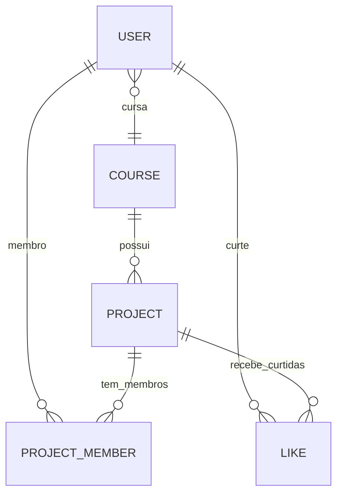

# 🗄️ Diagrama do Banco de Dados - Academic Showcase

**Data:** 09/07/2026  
**Engine:** PostgreSQL (Neon)  
**ORM:** Prisma Client

---

## 📊 Modelo Entidade-Relacionamento



---

## 📋 Entidades e Atributos

### 1. User (Usuário)
| Campo | Tipo | Restrições | Descrição |
|-------|------|------------|-----------|
| `id` | UUID | PK, auto-generated | ID único do usuário |
| `name` | String | obrigatório | Nome completo |
| `email` | String | único, obrigatório | E-mail (login) |
| `password` | String | obrigatório | Senha hashada |
| `role` | Enum | padrão: STUDENT | STUDENT, ADMIN, COORDENADOR |
| `courseId` | UUID | FK opcional | Curso que o usuário pertence |
| `createdAt` | DateTime | auto | Data de criação |
| `updatedAt` | DateTime | auto | Data de atualização |

**Índices:** `email`

---

### 2. Course (Curso)
| Campo | Tipo | Restrições | Descrição |
|-------|------|------------|-----------|
| `id` | UUID | PK, auto-generated | ID único do curso |
| `name` | String | único, obrigatório | Nome do curso |
| `description` | String | opcional | Descrição do curso |

---

### 3. Project (Projeto)
| Campo | Tipo | Restrições | Descrição |
|-------|------|------------|-----------|
| `id` | UUID | PK, auto-generated | ID único do projeto |
| `title` | String | obrigatório | Título do projeto |
| `shortDescription` | String | obrigatório | Descrição curta (255 chars) |
| `description` | Text | obrigatório | Descrição completa |
| `thumbnailUrl` | String | opcional | URL da imagem de capa |
| `status` | Enum | padrão: PENDING_REVIEW | DRAFT, PENDING_REVIEW, APPROVED, REJECTED |
| `isFeatured` | Boolean | padrão: false | Destacar na homepage |
| `viewsCount` | Int | padrão: 0 | Contador de visualizações |
| `likesCount` | Int | padrão: 0 | Contador de likes |
| `courseId` | UUID | FK obrigatório | Curso do projeto |
| `createdAt` | DateTime | auto | Data de criação |
| `updatedAt` | DateTime | auto | Data de atualização |

**Índices:** `status, isFeatured`, `courseId`

---

### 4. ProjectMember (Membro do Projeto)
| Campo | Tipo | Restrições | Descrição |
|-------|------|------------|-----------|
| `projectId` | UUID | FK, PK parcial | ID do projeto |
| `userId` | UUID | FK, PK parcial | ID do usuário |
| `roleInfo` | String | opcional | Informação do papel (ex: "Leader", "Backend") |

**Relacionamento:** Exclusão em cascata (onDelete: Cascade)

---

### 5. Like (Curtida)
| Campo | Tipo | Restrições | Descrição |
|-------|------|------------|-----------|
| `userId` | UUID | FK, PK parcial | ID do usuário |
| `projectId` | UUID | FK, PK parcial | ID do projeto |

**Relacionamento:** Exclusão em cascata (onDelete: Cascade)

---

## 🔗 Relacionamentos

```
┌─────────────┐       ┌─────────────┐
│    USER     │       │   COURSE    │
└──────┬──────┘       └──────┬──────┘
       │                     │
       │ 1:N                 │ 1:N
       ▼                     ▼
┌─────────────┐       ┌─────────────┐
│ PROJECT_    │       │   PROJECT   │
│   MEMBER    │◄─────►│             │
└──────┬──────┘       └──────┬──────┘
       │                     │
       │ 1:N                 │ 1:N
       ▼                     ▼
┌─────────────┐       ┌─────────────┐
│    LIKE     │◄─────►│             │
└─────────────┘       └─────────────┘
```

### Detalhes dos Relacionamentos

| De | Para | Tipo | Descrição |
|----|------|------|-----------|
| User | Course | N:1 (opcional) | Usuário pertence a um curso |
| Project | Course | N:1 | Projeto pertence a um curso |
| ProjectMember | User | N:1 | Membro é um usuário |
| ProjectMember | Project | N:1 | Membro pertence a um projeto |
| Like | User | N:1 | Like pertence a um usuário |
| Like | Project | N:1 | Like pertence a um projeto |

---

## 📌 Enumerações

### Role (Papel do Usuário)
```typescript
enum Role {
  STUDENT     // Aluno padrão
  ADMIN      // Administrador do sistema
  COORDENADOR // Coordenador do curso
}
```

### ProjectStatus (Status do Projeto)
```typescript
enum ProjectStatus {
  DRAFT           // Rascunho (somente o autor vê)
  PENDING_REVIEW // Em análise pelos moderadores
  APPROVED       // Aprovado e visível publicamente
  REJECTED       // Rejeitado pelo moderador
}
```

---

## 🔍 Observações

1. **Atomic Counters:** `viewsCount` e `likesCount` são incrementados atomicamente no banco para evitar race conditions.

2. **Soft Delete:** Não há exclusão física. Projetos podem ter status alterado para gerenciar visibilidade.

3. **Cascata:** Ao deletar um projeto ou usuário, todos os registros relacionados (membros, likes) são excluídos automaticamente.

4. **Índices:** Criados para otimizar consultas por status/destaque e por curso.

---

## 📝 Próximos Passos (Seed Data Needed)

Para testar a API, recomenda-se inserir:
- [ ] 1+ Cursos em `Course`
- [ ] 1+ Usuários em `User` (com diferentes roles)
- [ ] 1+ Projetos em `Project` (status APPROVED para listagem pública)