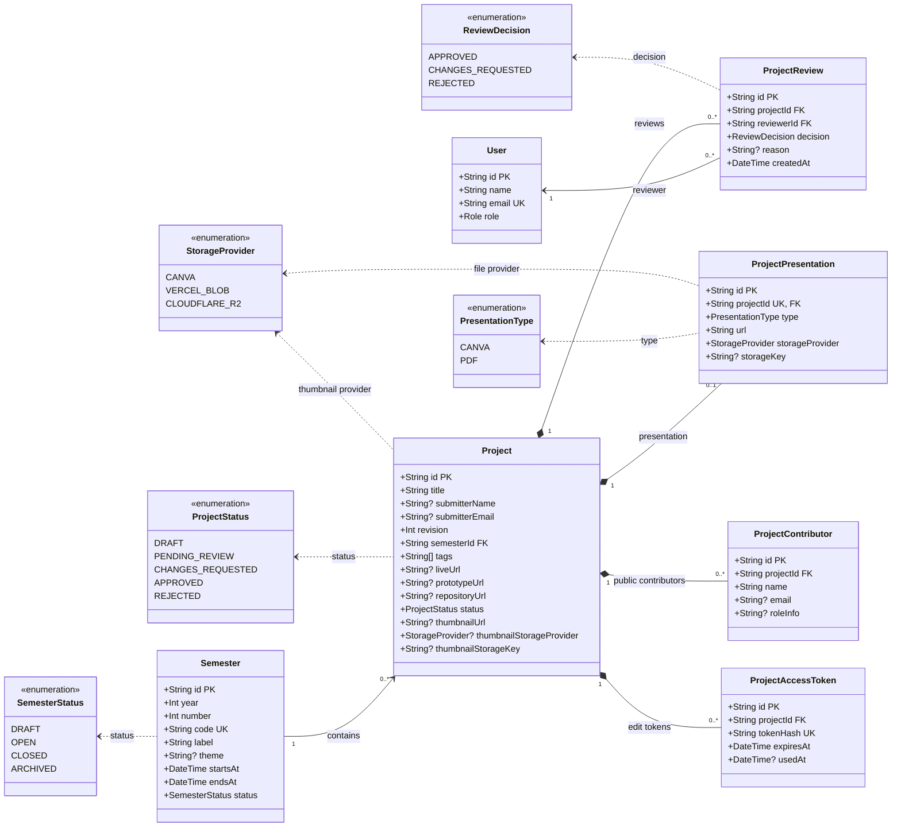

# Diagrama de classes do banco de dados

## Regras do fluxo

- O estudante não precisa de conta para criar uma submissão.
- O professor precisa estar autenticado para avaliar.
- `CHANGES_REQUESTED` significa que o estudante pode corrigir e reenviar.
- O token de correção é salvo somente como hash e expira em 72 horas.
- Ao reenviar, o token anterior é invalidado.
- A aprovação ou rejeição definitiva invalida tokens pendentes.
- O arquivo físico fica no provider indicado em `storageProvider`; o Neon guarda apenas URL e metadados.
