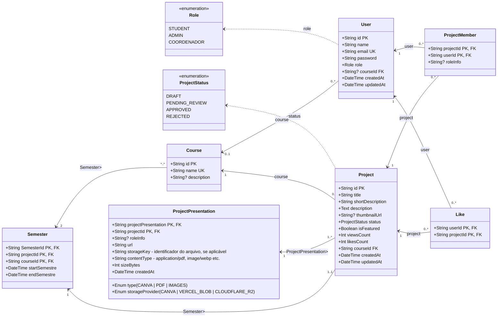

# Diagrama de classes do banco de dados

Fonte de verdade: `prisma/schema.prisma` e migrations em `prisma/migrations`.

## Regras de integridade

- `User.email` e `Course.name` são únicos.
- `ProjectMember` e `Like` usam chaves primárias compostas (`projectId` + `userId`).
- A remoção de um `User` ou `Project` remove seus respectivos `ProjectMember` e `Like` associados em cascata.
- A remoção de um `Course` não remove projetos: um projeto sempre exige um curso.
- A remoção de um curso desvincula os usuários associados (`courseId` passa a ser nulo).
