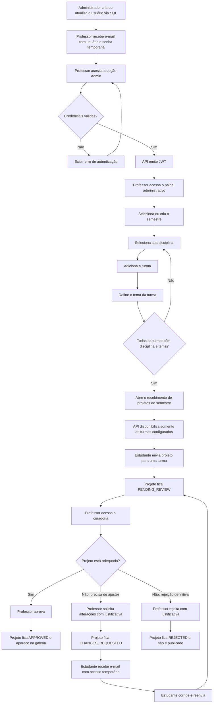
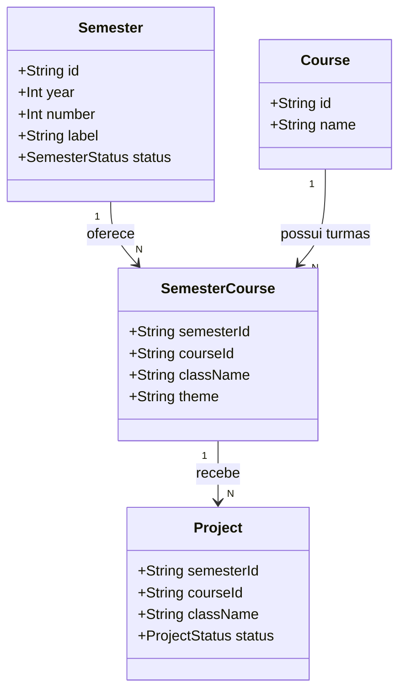

# Jornada do professor

Este documento descreve o fluxo de primeiro acesso e operação do professor/coordenador na plataforma Academic Showcase.

## Atores

- **Administrador**: gerencia os usuários por SQL e define o papel (`ADMIN` ou `COORDENADOR`). Não existe cadastro público de administradores.
- **Professor**: recebe as credenciais temporárias, acessa a área administrativa, configura sua disciplina/turma e avalia os projetos.
- **Estudante**: envia projetos sem criar uma conta. Quando necessário, recebe um acesso temporário para corrigir e reenviar o trabalho.

## Fluxo principal

## Primeiro acesso

1. O administrador cria ou atualiza o usuário diretamente no banco de dados.
2. O usuário precisa ter o papel `ADMIN` ou `COORDENADOR`.
3. O administrador envia o e-mail e a senha temporária por um canal seguro.
4. O professor abre a área administrativa e informa e-mail e senha.
5. A API valida as credenciais e retorna um JWT.
6. O frontend armazena o token e libera as rotas administrativas.

Não existe endpoint público de cadastro de professores.

## Configuração do semestre

O semestre representa apenas o período acadêmico. A disciplina, turma e tema são configurados em `SemesterCourse`.

O mesmo curso pode ter várias turmas no mesmo semestre, desde que cada turma tenha um nome diferente. Cada turma pode possuir um tema próprio.

## Ciclo de moderação

| Ação do professor | Status do projeto | Resultado |
| --- | --- | --- |
| Aprovar | `APPROVED` | Projeto publicado na galeria |
| Solicitar alterações | `CHANGES_REQUESTED` | Estudante recebe acesso temporário para corrigir |
| Rejeitar definitivamente | `REJECTED` | Projeto não é publicado |

Ao solicitar alterações, o professor deve informar uma justificativa. O estudante utiliza o token temporário recebido por e-mail para acessar, corrigir e reenviar o projeto.

## Regras importantes

- O semestre só pode ser aberto se possuir pelo menos uma turma configurada.
- Cada turma habilitada precisa ter um tema definido antes da abertura.
- O estudante só visualiza e seleciona turmas do semestre com recebimento aberto.
- Um projeto pertence a uma única turma.
- Um professor autenticado pode aprovar, solicitar alterações ou rejeitar projetos.
- A aprovação é o único estado que publica o projeto na galeria.
- O token temporário de correção não substitui o login administrativo.
